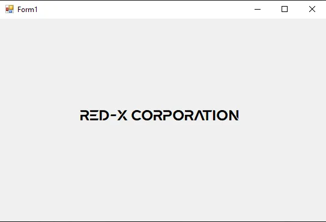

# CUSTOM-FONT-IN-C-SHARP-WITHOUT-INSTALLING-THE-FONT

## 🎯 Overview
This project shows how to **use custom embedded fonts in a C# WinForms application without installing them on the system**.  
It works by embedding font files as resources and loading them at runtime using a custom `EmbeddedFontLoader` class.

---




---

## 🚀 Features
- Load fonts directly from **embedded resources** (no external dependencies).
- Apply fonts to any WinForms control at runtime.
- Avoid requiring administrator privileges or modifying system fonts.
- Cleans up temporary files after use.

---

## 📂 Project Structure
```
CUSTOM-FONT-IN-C-SHARP-WITHOUT-INSTALLING-THE-FONT/
├──CUSTOM FONT LOADER.sln  # Visual Studio solution file
└──CUSTOM FONT LOADER
   └── EmbeddedFontLoader.cs   # Handles loading/disposal of embedded fonts
   └── Form1.cs                # Example usage of custom fonts in a WinForm
   └── Form1.Designer.cs       # UI designer file
   └── Program.cs              # Entry point

```

---

## ⚙️ How It Works
1. **Embed your font file**  
   - Add your `.ttf` file (e.g., `Nevan RUS.ttf`) into the project.  
   - Set its **Build Action** to `Embedded Resource`.

2. **Load the font at runtime** using `EmbeddedFontLoader`:  
   ```csharp
   private void Form1_Load(object sender, EventArgs e)
   {
       _fontLoader = new EmbeddedFontLoader();

       _fontLoader.LoadFontsFromResources(
           "CUSTOM_FONT_LOADER.Nevan RUS.ttf"  // Namespace + file name
       );

       label1.Font = new Font(
           _fontLoader.GetFontFamilyByName("Nevan RUS"),
           18f,
           FontStyle.Regular
       );
   }
   ```

3. **Apply the font** to any WinForms control (`Label`, `Button`, `TextBox`, etc.).

---

## 📝 Important Notes
- The resource name must include the **namespace + file name** (e.g., `CUSTOM_FONT_LOADER.Nevan RUS.ttf`).  
- Use the **internal font family name** (`Nevan RUS` in this example) when retrieving it with `GetFontFamilyByName`.  
- `EmbeddedFontLoader` automatically cleans up temporary font files when disposed.

---

## 🧩 Example: `EmbeddedFontLoader` Class
The loader handles:
- Extracting embedded font resources
- Writing them to a temporary file
- Registering them with `PrivateFontCollection`
- Returning usable `FontFamily` objects
- Cleaning up temp files on `Dispose`

---

## 📦 Usage
1. Clone the repo:
   ```bash
   git clone https://github.com/mohtasimjitu/CUSTOM-FONT-IN-C-SHARP-WITHOUT-INSTALLING-THE-FONT.git
   ```
2. Open the solution in **Visual Studio**.
3. Build and run the project — the `Nevan RUS` font will be applied to `label1` without installation.

---

## 🤝 Contributing
Pull requests are welcome! You can improve by:
- Supporting multiple font formats (`.otf` in addition to `.ttf`)
- Adding error handling or fallbacks
- Extending usage examples

---

## 📜 License
This project is open-source. Add a license file if you want to specify usage rights.

---
